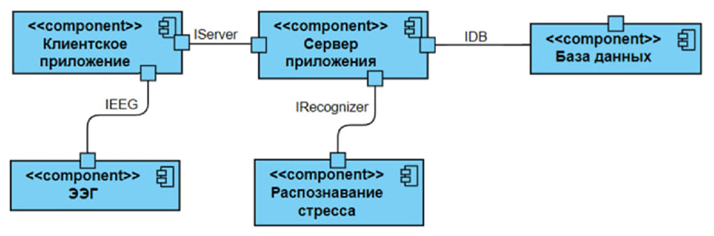

# RelaxMe

Приложение RelaxMe предназначено для снижения уровня стрессса пользователя с помощью 
подбора и демонстрации видеозаписей, соответствущих индивидуальным предпочтениям 
пользователя. 

Архитектура ПО микросервесная, сервисы разработаны с использованием принципов луковичной архитектуры, 
микросервисное общение осуществляется через REST API.

**Микросервис распознавания стресса** отвечает за обработку ЭЭГ данных и предсказания стресса. 

**Сервер приложения** предоставляет единый центральный API для приложения. 

**Клиентское приложение** предоставляет пользователю графический интерфейс и собирается вместе с модулем ЭЭГ
для передачи данных нейроинтерфейса, подключённого напрямую к компьютеру пользователя.

RelaxMe распознаёт стресс человека по данным ЭЭГ с помощью нейронной сети прямого
распространения, обученной на собственно собранном датасете.

## Описание переменных окружения:

### Stress Recognizer
- **APP_PORT** - порт, на котором запущен сервер
- **NN_WEIGHTS_PATH** - путь к файлу с весами нейросети
- **NN_FEATURES_COUNT** - количество входных признаков нейросети (целое число) 
- **SFREQ** - частота дискретизации данных ЭЭГ по умолчанию
- **EEG_CHANNEL_NAMES** - имена ЭЭГ каналов по умолчанию
- **LOW_CUTOFF** - нижняя граница фильтра для данных ЭЭГ
- **HIGH_CUTOFF** - верхняя граница фильтра для данных ЭЭГ
- **EPOCH_DURATION** - продолжительность эпохи ЭЭГ в секундах

### Backend
- **APP_PORT** - порт, на котором запущен сервер
- **stress_service_endpoint** - адрес API микросервиса Stress Recognizer 
- **POSTGRES_URL** - строка подключения к PostgreSQL в формате `postgresql+asyncpg://<Имя_пользователя>:<Пароль>@<Адрес>:<Порт>/<Имя_БД>`
- **POSTGRES_USER** - имя пользователя PostgreSQL
- **POSTGRES_PASSWORD** - пароль пользователя PostgreSQL
- **POSTGRES_DB** - имя базы данных PostgreSQL
- **POSTGRES_PORT** - порт PostgreSQL

### Client
- **EEG_SERVICE_ENDPOINT** - адрес API сервиса ЭЭГ в микросервисе Backend
- **STRESS_SERVICE_ENDPOINT** - адрес API сервиса стресса в микросервисе Backend
- **EEG_INTERVAL** - интервал отправки данных ЭЭГ на распознавание стресса в секундах

### Ручной запуск на хостовой машине

1. Установить Python 3.11
2. Установить PostgreSQL 16.0+
3. Установить зависимости из requirements.txt
4. Создать файл `.env` с перечисленными переменными окружения
5. Обновить базу данных командой `alembic upgrade head`
6. Запустить проект командой `python main.py`

### Запуск микросервисов через Docker Compose

1. Создать файл `.env` с перечисленными переменными окружения
2. Запустить сборку командой `docker compose -f docker-compose.yml up`
